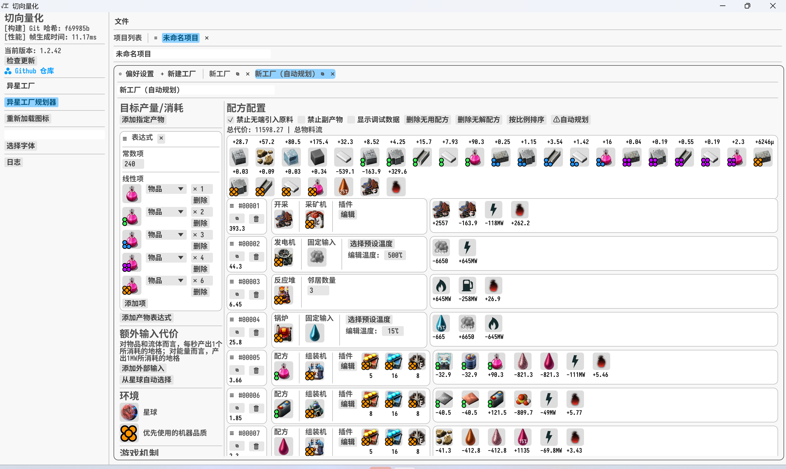
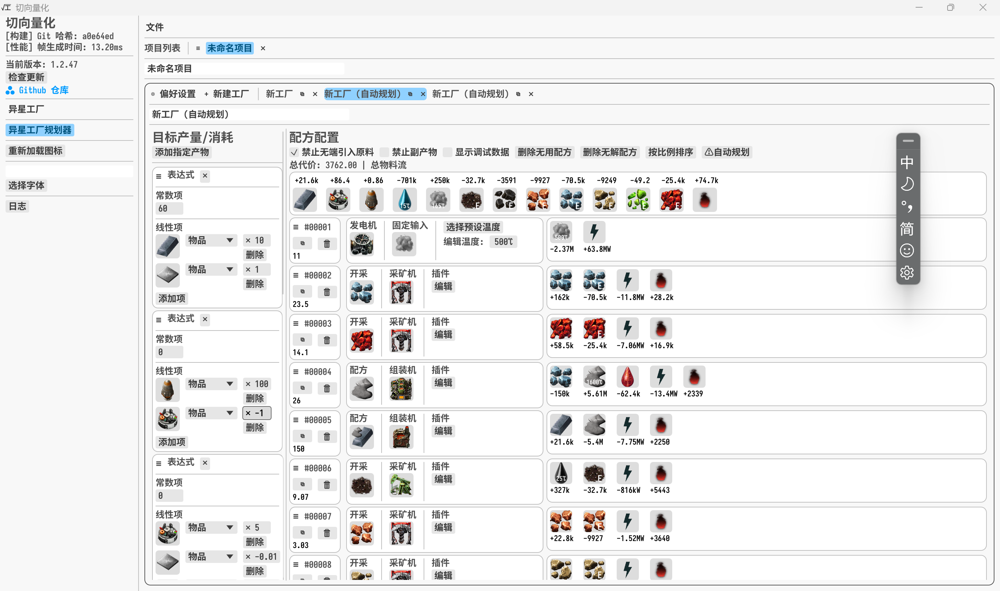
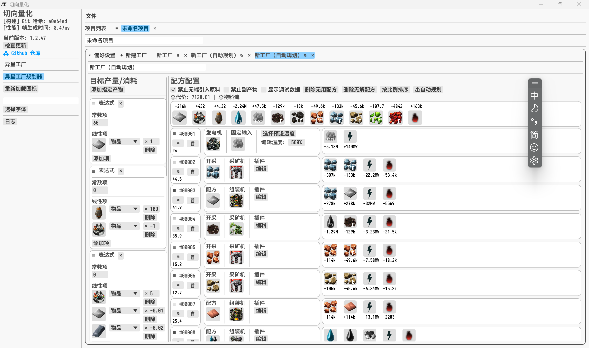

# 警告

使用自动规划工具前，请自行检查游戏数据不会使得状态空间过于膨胀！！！针对离谱数值机器的枚举微调正在规划中，但不是主要内容。如使用[exfret's randomizer](https://mods.factorio.com/mod/propertyrandomizer)产生插件槽过多的机器。目前的临时限制为：超过8个插件槽位的机器不会尝试枚举空插件，且插件槽过多的机器可能会忽视绝大部分槽位。

# 切向量化工具 Metatorio

切向量化是切向量正在锐意制作中的量化工具，主要用于异星工厂中的问题计算。切向量化使用了顶针的修辞手法，令人忍俊不禁。

# 使用方法

1. （使用新的模组集时）点击最上方的加载游戏按钮
   1. 选择异星工厂可执行文件的路径
   2. （可选）选择模组文件夹的路径
   3. 确认加载确认
2. （可选）在右侧面板选择用于计算的游戏上下文，也可以在这里更改缓存的名称
3. 点击导入项目的左侧 + 号创建新项目
4. 点击下一行的 + 好添加新工厂
   1. 可以在左侧编辑工厂的生产目标、生产表达式、所在星球、外部输入代价
   2. 可以在左侧编辑项目的里程碑设定、配方产能、采矿产能、品质偏好，以及最下方编辑「自动规划」功能的插件枚举范围和枚举的插件塔组合预设
   3. 可以在中间上方点击添加机制按钮手动添加游戏机制，包括但不限于配方、采矿、燃烧物品、变质、种植
   4. 可以在中间上方点击自动规划按钮，根据左侧设定的条件尝试自动添加机制。如果失败，可能是问题本身过于复杂，可以尝试添加外部输入、减少产量。建议启用严格供给模式再运行自动规划。
   5. 可以在右侧查看求解结果的工厂的产量以及副产物产量。

## 产物表达式

（以下为旧版本截图，新版本操作顺序不同但结果一致）

现在可以在生产目标中添加表达式。常见需求：计算最优的科研容量生产方式。



目前的结论为，原版+SA下只有粉瓶值得生产精良以上品质的：不到一带废料可以生产一带的科研容量。涉及到物流瓶颈另算。

更复杂的表达式可以模拟规划器无法理解的机制。如在后期的太空探索游戏中，制造铁锭运输再解压缩相比制造铁板成铁板运输可以节省约50%的成本。



# 关于模组支持

我已经测试过了[太空探索](https://mods.factorio.com/mod/space-exploration)、 [K2](https://mods.factorio.com/mod/Krastorio2)、[Py](https://mods.factorio.com/mod/pymodpack)和[无主之地](https://mods.factorio.com/mod/nullius)系列，2.0版本和2.1版本的异星工厂游戏数据应该会正常加载，大部分功能都可正常使用。自动规划功能在原版+品质、DLC、太空探索+品质、Py下尝试求解传说物品的生产流程时可能失败，在状态空间较多时可能会内存超出，谨慎考虑添加枚举插件、枚举插件塔的数量！

# 构建

使用 pnpm 构建运行：

```sh
pnpm tauri build
```

自行构建的版本无法缺少签名，无法自动更新。

# 贡献

欢迎提交各种 issue、pull request 或在其他社交网站上联系我反馈问题和提供建议。

# 许可

见 LICENSE。