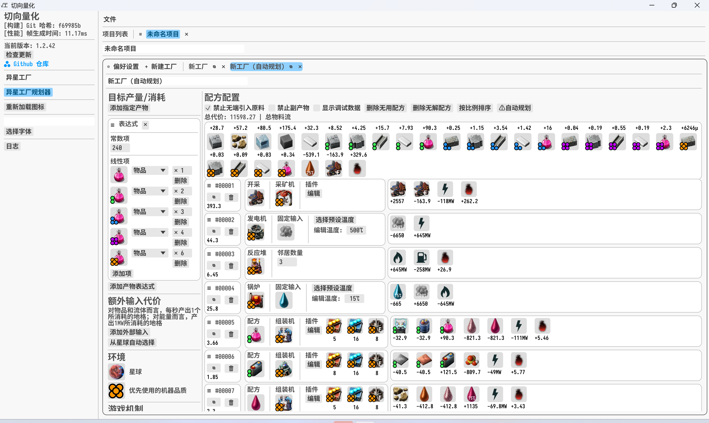
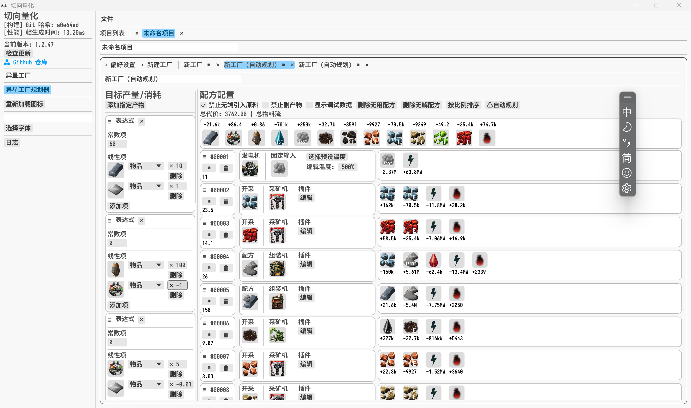
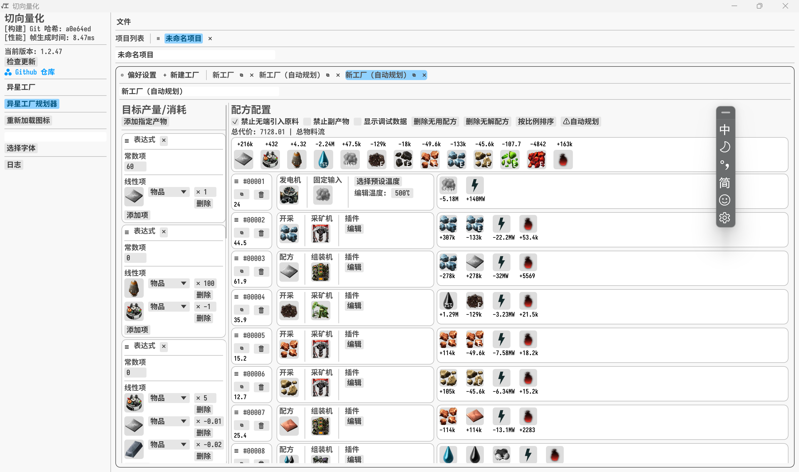

# 警告

使用自动规划工具前，请自行检查游戏数据不会使得状态空间过于膨胀！！！针对离谱数值机器的枚举微调正在规划中，但不是主要内容。如使用[exfret's randomizer](https://mods.factorio.com/mod/propertyrandomizer)产生插件槽过多的机器。目前的临时限制为：超过8个插件槽位的机器不会尝试枚举空插件，且插件槽过多的机器可能会忽视绝大部分槽位。

# 切向量化工具 Metatorio

切向量化是切向量正在锐意制作中的量化工具，主要用于异星工厂中的问题计算。切向量化使用了顶针的修辞手法，令人忍俊不禁。

# 使用方法

1. （使用新的模组集时）点击最上方的加载游戏按钮
   1. 选择异星工厂可执行文件的路径
   2. （可选）选择模组文件夹的路径
   3. 确认加载确认
2. （可选）在右侧面板选择用于计算的游戏上下文，也可以在这里更改缓存的名称
3. 点击导入项目的左侧 + 号创建新项目
4. 点击下一行的 + 号添加新工厂
   1. 可以在左侧编辑工厂的生产目标、生产表达式、所在星球、外部输入代价
   2. 可以在左侧编辑项目的里程碑设定、配方产能、采矿产能、品质偏好，以及最下方编辑「自动规划」功能的插件枚举范围和枚举的插件塔组合预设
   3. 可以在中间上方点击添加机制按钮手动添加游戏机制，包括但不限于配方、采矿、燃烧物品、变质、种植
   4. 可以在中间上方点击自动规划按钮，根据左侧设定的条件尝试自动添加机制。如果失败，可能是问题本身过于复杂，可以尝试添加外部输入、减少产量。建议启用严格供给模式再运行自动规划
   5. 可以在右侧查看求解结果的工厂的产量以及副产物产量
   
## 产物表达式

（以下为旧版本截图，新版本操作略有不同但结果一致）

现在可以在生产目标中添加表达式。常见需求：计算最优的科研容量生产方式。



目前的结论为，原版+SA下只有粉瓶值得生产精良以上品质的：不到一带废料可以生产一带的科研容量。涉及到物流瓶颈另算。

更复杂的表达式可以模拟规划器无法理解的机制。如在后期的太空探索游戏中，制造铁锭运输再解压缩相比制造铁板成铁板运输可以节省约50%的成本。



# 关于模组支持

我已经测试过了[太空探索](https://mods.factorio.com/mod/space-exploration)、 [K2](https://mods.factorio.com/mod/Krastorio2)、[Py](https://mods.factorio.com/mod/pymodpack)和[无主之地](https://mods.factorio.com/mod/nullius)系列，2.0版本和2.1版本的异星工厂游戏数据应该会正常加载，大部分功能都可正常使用。自动规划功能在原版+品质、DLC、太空探索+品质、Py下尝试求解（传说）物品的生产流程时可能失败，在状态空间较多时可能会内存超出，谨慎考虑添加枚举插件、枚举插件塔的数量！

# 构建与开发环境

本仓库横跨 **Rust / C++ / TypeScript** 三种语言，先把工具链一次讲清楚。

## 工具链一览

| 组件 | 版本 | 用途 | 什么时候需要 |
| --- | --- | --- | --- |
| Rust | **≥ 1.85**（edition 2024；CI 用 stable） | 求解器内核（`crates/metatorio-solver` 等）+ Tauri 后端 | 编译一切 |
| C++ 编译器 | 支持 C++11 即可（MSVC 2022 / GCC / Clang） | 编译 HiGHS 线性规划求解器 | 编译 `metatorio-solver` 时 |
| CMake | **≥ 3.15**（实测 4.1 可用） | HiGHS 的构建系统 | 同上 |
| Ninja（可选） | 任意 | 加速 HiGHS 的 CMake 构建 | 同上 |
| LLVM / libclang | LLVM 14+ | `highs-sys` 用 bindgen 生成 C 绑定 | 同上 |
| Node.js | LTS | 前端构建脚本 | 前端 / 打包 |
| pnpm | 9.x | 前端包管理 | 前端 / 打包 |
| Tauri v2 系统库 | 见下 | 桌面壳 | Linux 打包 |

> **为什么会有 C++？** 求解器曾用纯 Rust 的 clarabel + microlp，但两者在
> 「列高度相似、系数跨二十个数量级」的大 LP 上都不可靠（内点法给不出顶点、
> 单纯形报 Singular matrix）。现在换成 [HiGHS](https://highs.dev/)（`good_lp`
> 的 `highs` feature）。`highs` crate 内置 HiGHS 源码，`cargo build` 时会先用
> CMake 把 C++ 编出来、再用 bindgen 生成绑定——所以工具链里多了 C++ / CMake /
> LLVM。首次构建约 2 分钟，之后走 `target/` 缓存。

## 按平台装齐

**Windows**（VS 2022 生成工具即可）：

```powershell
winget install Kitware.CMake Ninja-build.Ninja LLVM.LLVM
# 或：choco install cmake ninja llvm -y
# 再把 C:\Program Files\LLVM\bin 加进 PATH（或设 LIBCLANG_PATH 指向它）
```

**Ubuntu / Debian**：

```sh
sudo apt install build-essential cmake ninja-build clang libclang-dev
# Tauri 还需要：
sudo apt install libwebkit2gtk-4.1-dev libappindicator3-dev librsvg2-dev patchelf libssl-dev
```

## 常用命令

```sh
# 只跑求解器（最快，不碰前端）
cargo test -p metatorio-solver

# 全量 Rust 测试
cargo test --workspace

# 需要真实游戏数据的长用例（可选，约几分钟）
cargo test --release -p metatorio-runtime --lib legendary_biter_egg -- --ignored --nocapture

# 打包桌面应用
cd metatorio-app && pnpm install && pnpm tauri build
```

# 贡献

欢迎提交各种 issue、pull request 或在其他社交网站上联系我反馈问题和提供建议。

# 许可

见 LICENSE。